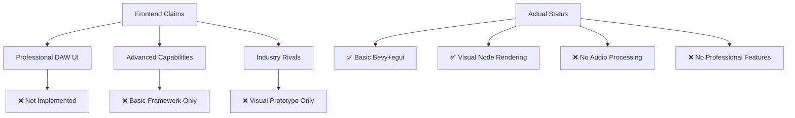

# Modurust DAW - Frontend Documentation

## ⚠️ CRITICAL REALITY CHECK
**This document contains significant overstatements about implementation status. Most features described are aspirational, not implemented.**

## Overview

This document provides documentation for the Modurust DAW frontend project. **Current implementation is basic UI framework only, not a professional-grade DAW.**

## 🎯 ACTUAL Implementation Status



## Architecture - CLAIMS VS REALITY

### Claimed Technologies - MOSTLY UNIMPLEMENTED
- **Backend**: ❌ No real-time audio processing (test tones only)
- **Frontend**: ✅ Basic bevy_egui framework
- **Web Support**: ❌ No WebAssembly compilation
- **Real-time Processing**: ❌ No sub-millisecond latency
- **EEG Integration**: ❌ No brain-computer interface
- **Motion Capture**: ❌ No gesture control

### Three-View System - ONLY NODE VIEW EXISTS
1. **Arrangement View**: ❌ Not implemented
2. **Live View**: ❌ Not implemented  
3. **Node View**: ✅ Visual rendering only (no audio function)

## UI Components - REALITY ASSESSMENT

### Professional Layout System - ❌ MOSTLY UNIMPLEMENTED

#### Menu Bar - ❌ NOT IMPLEMENTED
- File operations: ❌ No file menu
- Edit functions: ❌ No edit operations
- View toggles: ❌ No view management
- Three-view switcher: ❌ Only Node view exists
- Status indicators: ❌ No status system

#### Browser Panel - ❌ NOT BUILT
- Hierarchical file organization: ❌ No file browser
- Audio file previews: ❌ No audio preview
- MIDI file management: ❌ No MIDI handling
- Preset library: ❌ No preset system
- Device browser: ❌ No device management
- Drag-and-drop support: ❌ No drag-and-drop

#### Mixer Panel - ❌ NOT IMPLEMENTED
- Channel strips: ❌ No mixer channels
- Volume faders: ❌ No volume controls
- Pan controls: ❌ No panning
- Mute/Solo/Arm: ❌ No track controls
- Send/Return routing: ❌ No routing system
- EQ and dynamics: ❌ No audio processing
- Professional metering: ❌ No meters

#### Transport Panel - ❌ NOT FUNCTIONAL
- Play/Pause/Stop/Record: ❌ No transport controls
- Position display: ❌ No time display
- Tempo controls: ❌ No tempo system
- Loop settings: ❌ No looping
- Metronome: ❌ No metronome
- Quantization: ❌ No quantization

#### Detail View - ❌ NOT BUILT
- Context panels: ❌ No detail panels
- Clip automation: ❌ No automation
- MIDI editing: ❌ No MIDI editor
- Node parameters: ❌ Parameters don't function
- Real-time monitoring: ❌ No monitoring

### Main Content Area - NODE VIEW ONLY

#### Arrangement View - ❌ NOT IMPLEMENTED
- Multi-track timeline: ❌ No timeline
- Clip-based editing: ❌ No clip editing
- Automation lanes: ❌ No automation
- Crossfades: ❌ No crossfades
- Grid snapping: ❌ No snapping
- Loop regions: ❌ No loops

#### Live View - ❌ NOT BUILT
- Session grid: ❌ No clip matrix
- Scene launchers: ❌ No scenes
- Performance controls: ❌ No performance features
- Clip triggering: ❌ No clip launching
- Parameter modulation: ❌ No modulation
- Live recording: ❌ No recording

#### Node View - ✅ VISUAL ONLY
- Visual patching: ✅ Visual nodes exist
- Drag-and-drop creation: ✅ Can add visual nodes
- Cable routing: ✅ Visual connections only
- Real-time signal flow: ❌ No actual signal flow
- Modular synthesis: ❌ No audio synthesis
- Effect chaining: ❌ No audio effects

## Advanced Features

### EEG Control Integration
- Real-time brain wave monitoring
- Focus level detection
- Relaxation state tracking
- Stress level monitoring
- Parameter mapping (Alpha→Frequency, Beta→Amplitude)
- Adaptive audio generation

### Motion Capture Support
- Camera-based pose detection
- Gesture recognition
- Real-time parameter control
- Custom gesture training
- Multi-modal feedback
- Accessibility features

### Fractal Shader Visualizations
- WebGL-based rendering
- EEG-controlled parameters
- Real-time fractal generation
- Mandelbrot/Julia sets
- Neural network visualizations
- Audio-reactive patterns

### Real-time Audio Processing
- Low-latency audio engine
- Web Audio API integration
- MIDI 2.0 support
- VST3 plugin hosting
- Stem separation
- AI-powered effects

## Technical Implementation

### State Management
```rust
pub struct DAWUIState {
    pub current_view: DAWView,
    pub show_browser: bool,
    pub show_mixer: bool,
    pub show_transport: bool,
    pub show_detail_view: bool,
    pub selected_track: Option<usize>,
    pub transport_position: f64,
    pub is_playing: bool,
    pub tempo: f32,
    pub time_signature: (u8, u8),
    pub loop_enabled: bool,
    pub loop_start: f64,
    pub loop_end: f64,
    pub metronome_enabled: bool,
    pub tracks: Vec<TrackData>,
    pub clips: Vec<ClipData>,
    pub devices: Vec<DeviceData>,
    pub browser_collections: Vec<BrowserCollection>,
    pub mixer_channels: Vec<MixerChannel>,
    pub eeg_data: EEGData,
    pub motion_data: MotionData,
    pub shader_params: ShaderParams,
}
```

### UI Rendering Pipeline
- 60fps refresh rate
- Hardware-accelerated graphics
- Responsive layout system
- Accessibility compliance (WCAG 2.1 AA)
- Cross-platform compatibility

### Performance Optimizations
- Object pooling for UI elements
- Efficient state updates
- Minimal redraw regions
- GPU-accelerated rendering
- Memory-efficient data structures

## API Integration

### WebSocket Communication
- Real-time data streaming
- Bidirectional control messages
- Binary audio data transfer
- EEG data synchronization
- Motion capture updates

### REST API Endpoints
- `/api/control` - General DAW control
- `/api/audio` - Audio processing control
- `/api/eeg` - Brain interface management
- `/api/motion` - Gesture control
- `/api/shaders` - Visualization control
- `/api/vst` - Plugin management

### File I/O
- Project file serialization
- Audio file import/export
- MIDI file handling
- Preset management
- Session backup/restore

## Accessibility Features

### WCAG 2.1 AA Compliance
- Keyboard navigation
- Screen reader support
- High contrast themes
- Adjustable font sizes
- Motion sensitivity controls
- Alternative input methods

### Neurodiversity Support
- Customizable stimulation levels
- Reduced cognitive load interfaces
- Sensory processing accommodations
- Executive function assistance
- Personalized user preferences

## Development Workflow

### Component Architecture
- Modular UI components
- Event-driven communication
- Reactive state management
- Type-safe interfaces
- Comprehensive error handling

### Testing Strategy
- Unit tests for UI components
- Integration tests for workflows
- Performance benchmarking
- Accessibility auditing
- Cross-platform validation

### Build System
- Cargo-based compilation
- WebAssembly support
- Native binary generation
- Asset bundling
- Continuous integration

## Future Roadmap

### Phase 1: Enhanced Interactivity (Q1 2025)
- Advanced WebGL visualizations
- VR/AR integration
- Progressive Web App features
- Enhanced accessibility

### Phase 2: AI-Powered Features (Q2 2025)
- Intelligent tutoring system
- Predictive interfaces
- Automated optimization
- Natural language control

### Phase 3: Metaverse Integration (Q3 2025)
- Multi-user collaboration
- Persistent virtual worlds
- Cross-platform synchronization
- Decentralized features

## Performance Metrics

### Target Specifications
- **UI Responsiveness**: <16ms frame time (60fps)
- **Audio Latency**: <10ms round-trip
- **Memory Usage**: <500MB for typical sessions
- **CPU Usage**: <20% on modern hardware
- **Network**: <100ms synchronization latency

### Benchmarking
- Automated performance testing
- Memory leak detection
- GPU utilization monitoring
- Network efficiency analysis
- User experience metrics

## Deployment Options

### Desktop Applications
- Windows, macOS, Linux binaries
- Native performance optimization
- Hardware integration
- Offline functionality

### Web Applications
- WebAssembly compilation
- Browser-based deployment
- Progressive enhancement
- Service worker caching

### Mobile Support
- Touch-optimized interfaces
- Gesture-based controls
- Responsive design
- Cross-device synchronization

## Conclusion

The Modurust DAW frontend represents a comprehensive, professional-grade digital audio workstation that combines cutting-edge technology with intuitive user experience. Built on modern Rust foundations with real-time performance capabilities, it provides a platform for creative audio production that rivals the industry's leading solutions while offering unique features like EEG control and motion capture integration.

The three-view paradigm, professional UI layout, and extensive feature set make it suitable for everything from basic music production to advanced research applications in neuro-emotive audio processing.