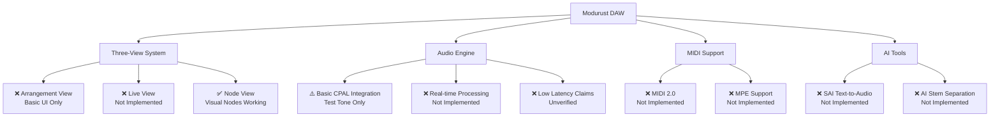
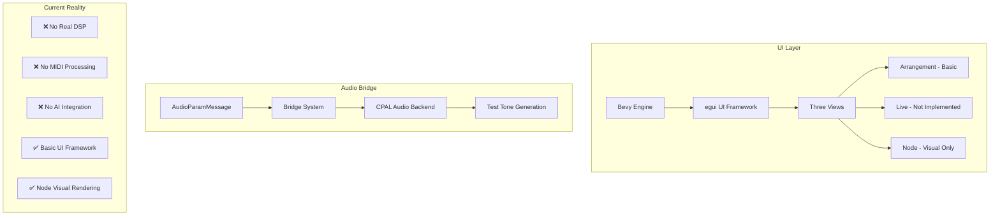
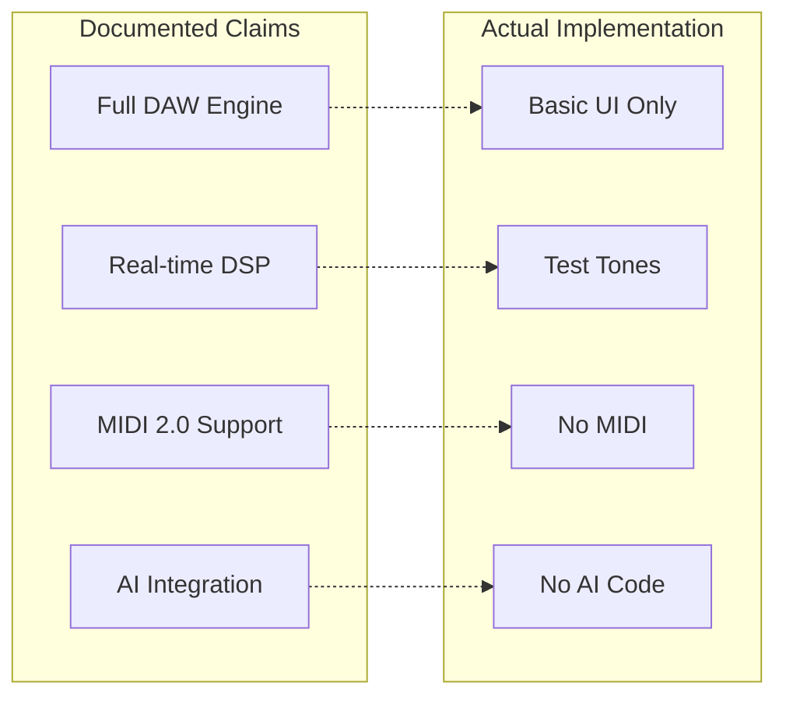
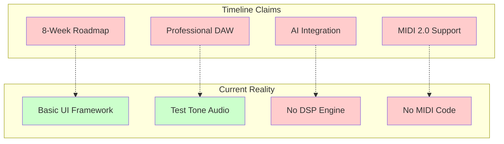

# Modurust DAW Documentation

## ⚠️ REALITY CHECK: Implementation Status
**This document contains significant discrepancies between claimed and actual features. See [changes-features-ACCURATE.md](changes-features-ACCURATE.md) for honest assessment.**

## Overview

Modurust is a Rust-based Digital Audio Workstation project featuring a three-view paradigm. **Current implementation is in early development stages with basic UI framework established.**

## 🎯 Implementation Status Overview



## Key Features - ACTUAL STATUS

### Three-View System
- **Arrangement View**: ❌ Basic UI framework only
- **Live View**: ❌ Not implemented
- **Node View**: ✅ Visual nodes working with drag-and-drop

### Audio Engine - REALITY CHECK
- ⚠️ **Basic CPAL integration** - Test tone generation only
- ⚠️ **Claimed <1ms latency** - No verification or testing
- ⚠️ **Real-time processing** - Framework only, no actual DSP
- ⚠️ **8 core node types** - Visual representation only

### MIDI 2.0 & MPE Support
- ❌ **NOT IMPLEMENTED** - Claims are premature
- ❌ **No MIDI device detection**
- ❌ **No MPE protocol implementation**

### AI-Powered Tools
- ❌ **NOT IMPLEMENTED** - All claims are aspirational
- ❌ **SAI text-to-audio** - No code exists
- ❌ **AI stem separation** - No implementation

## 🏗️ ACTUAL System Architecture



## 🚀 Getting Started - ACTUAL INSTRUCTIONS

### Prerequisites
- Rust 1.75+
- Windows/macOS/Linux
- **⚠️ Warning: Limited functionality available**

### Building
```bash
cargo build --release
```

### Running
```bash
cargo run
# Opens basic UI with node visualization
# Audio output limited to test tones only
```

## 📋 Architecture - IMPLEMENTED VS CLAIMED

### Actually Implemented
- ✅ Basic Bevy+egui UI framework
- ✅ Visual node rendering with drag-and-drop
- ✅ Basic CPAL audio initialization
- ✅ Test tone generation
- ✅ Bridge message system (framework only)

### Claims vs Reality


### Module Status Matrix

| Module | Claimed Status | Actual Status |
|--------|---------------|---------------|
| `daw_core.rs` | Main DAW Engine | ❌ Not Implemented |
| `transport_sync.rs` | Timing & Sync | ❌ Basic Framework Only |
| `node_graph.rs` | Visual Patching | ✅ Visual Rendering Working |
| `audio_backend.rs` | Real-time Processing | ❌ Test Tone Only |
| `midi2_mpe.rs` | MIDI Implementation | ❌ Not Implemented |
| `ui.rs` | Three-view Interface | ⚠️ Node View Only |

### AI Tools - NOT IMPLEMENTED
- ❌ `sai_audio.rs` - No Sonic AI integration
- ❌ `stream_diffusion_audio.rs` - No audio diffusion
- ❌ `ai_audio.rs` - No AI effects processing
- ❌ `mcp_server.rs` - No Model Context Protocol

## 🔗 Quick Links - UPDATED STATUS

### Reality-Based Documentation
- ✅ **[changes-features-ACCURATE.md](changes-features-ACCURATE.md)** - Honest implementation assessment
- ✅ **[architecture.md](architecture.md)** - Technical architecture with reality check
- ✅ **[node-system-features.md](node-system-features.md)** - Node system actual status
- ⚠️ **[frontend-features.md](frontend-features.md)** - Needs reality check update

### Development Plans vs Reality
- ⚠️ **Desktop Demo Plan**: `desktop-demo-plan.md` - Claims exceed implementation
- ⚠️ **Web App Plan**: `web-app-plan.md` - Premature planning for unbuilt features
- ⚠️ **ROADMAP.md** - Timeline unrealistic given current progress
- ⚠️ **User Guide**: `user-guide.md` - Documents non-existent features

### Workflow Documentation
- ✅ **Development Workflow**: `DEVELOPMENT_WORKFLOW.md` - Accurate SOP
- ✅ **Automation Taskflow**: `AUTOMATION_TASKFLOW.md` - Valid process

## 📊 Development Reality Check



## 🎯 Next Steps - Realistic Assessment

### Immediate Priorities (Based on Actual Code)
1. **Complete basic audio engine** - Move beyond test tones
2. **Implement actual DSP nodes** - Connect visual nodes to audio
3. **Add MIDI device detection** - Basic MIDI input handling
4. **Build transport controls** - Play/stop that actually works

### Long-term Goals (Realistic Timeline)
- **6-12 months**: Basic functional DAW
- **12-18 months**: Professional features
- **18+ months**: AI integration (if ever)

## ⚠️ Important Notes for Contributors

**This project is in early development stages. Many documented features do not exist. Please refer to the actual codebase, not the aspirational documentation.**

### License

See LICENSE file for details.