# Modurust DAW Architecture

## Overview

Modurust is built on a modular architecture that separates concerns into distinct layers, enabling high performance, maintainability, and extensibility. This document reflects the **actual implementation status** as of November 2025.

## Core Architecture

### Three-View System Implementation Status

```mermaid
graph TB
    subgraph "Three-View UI System"
        A["Arrangement View<br/>🟡 Partially Implemented"]
        L["Live View<br/>🟡 Partially Implemented"] 
        N["Node View<br/>🟢 Visual Canvas Implemented"]
    end
    
    subgraph "Audio Engine"
        AE["HexoDSPEngine<br/>🟢 Core Implemented"]
        NG["Node Graph<br/>🟢 Basic Implementation"]
        TR["Transport<br/>🟢 Basic Controls"]
    end
    
    subgraph "Integration Status"
        UI["UI ↔ Audio Bridge<br/>🟡 Basic Messages Only"]
        NV["Node View ↔ Audio<br/>🔴 Not Connected"]
        AUTO["Automation<br/>🔴 Not Implemented"]
    end
    
    A --> UI
    L --> UI  
    N --> NV
    UI --> AE
    NV --> NG
    AE --> TR
```



### Implementation Reality vs Documentation

| Component | Documented Status | Actual Status | Gap Analysis |
|-----------|------------------|---------------|--------------|
| Arrangement View | ✅ Fully Implemented | 🟡 Basic UI Only | Missing: Timeline, clips, automation |
| Live View | ✅ Fully Implemented | 🟡 Basic UI Only | Missing: Clip matrix, scenes, performance features |
| Node View | ✅ Fully Implemented | 🟢 Visual Canvas | Missing: Audio connection, parameter sync |
| Audio Engine | ✅ Ultra-low latency | 🟢 Basic Implementation | Missing: Advanced DSP, effects chain |
| MIDI 2.0/MPE | ✅ Full Support | 🔴 Not Implemented | Complete gap |
| AI Tools | ✅ Multiple Features | 🔴 Not Implemented | Complete gap |
| VST3 Hosting | ✅ Native Support | 🟡 Stub Implementation | Non-functional |

## Module Hierarchy - Actual Implementation

```mermaid
graph TD
    subgraph "Core Systems - Implemented"
        A[bevy_egui_ui.rs<br/>🟢 Basic UI Framework]
        B[audio_engine/mod.rs<br/>🟢 Core Engine]
        C[node_graph.rs<br/>🟢 Basic Graph]
        D[transport.rs<br/>🟢 Basic Transport]
    end
    
    subgraph "UI Components - Partial"
        E[egui_ui_full.rs<br/>🟡 Large UI Structure]
        F[hexagonal_node_view.rs<br/>🟢 Visual Node Canvas]
        G[professional_daw_ui.rs<br/>🔴 Not Implemented]
    end
    
    subgraph "Audio Processing - Basic"
        H[cpal_io.rs<br/>🟢 Audio I/O]
        I[dsp_core.rs<br/>🟡 Basic DSP]
        J[node_instance_manager.rs<br/>🟡 Basic Manager]
    end
    
    subgraph "Planned but Missing"
        K[midi2_mpe.rs<br/>🔴 Not Implemented]
        L[ai_audio.rs<br/>🔴 Not Implemented]
        M[vst3_host.rs<br/>🔴 Stub Only]
        N[sai_audio.rs<br/>🔴 Not Implemented]
    end
    
    A --> B
    A --> E
    E --> F
    B --> H
    B --> I
    B --> J
    C --> J
    D --> B

### Current Implementation Status (November 2025)

#### ✅ **Fully Implemented Components**

**Core Audio Engine (`src/audio_engine/`)**
- `HexoDSPEngine`: Basic audio engine with transport controls
- `cpal_io.rs`: Audio I/O using CPAL library (Windows WASAPI, macOS CoreAudio, Linux ALSA)
- `transport.rs`: Basic transport (Play, Stop, Pause, Record, Tempo)
- `bridge.rs`: UI ↔ Audio communication bridge with message passing
- `node_graph.rs`: Basic node graph structure with add/remove/connect operations

**UI Framework (`src/ui/`)**
- `bevy_egui_ui.rs`: Basic Bevy+egui integration with panic handling
- `hexagonal_node_view.rs`: Visual node canvas with hexagonal nodes and connections
- `egui_ui_full.rs`: Large UI structure (mostly scaffolding)

#### 🟡 **Partially Implemented Components**

**Audio Processing (`src/audio_engine/`)**
- `dsp_core.rs`: Basic DSP foundation (minimal implementation)
- `node_instance_manager.rs`: Node management structure (needs audio integration)

**UI Components**
- Three-view UI system exists but mostly visual scaffolding
- Basic transport panel with play/stop/record controls
- Master volume and basic mixer controls

#### 🔴 **Not Implemented (Documentation Claims False)**

**Advanced Audio Features**
- `midi2_mpe.rs`: MIDI 2.0 and MPE support - **NOT IMPLEMENTED**
- `ai_audio.rs`: AI-powered audio effects - **NOT IMPLEMENTED** 
- `sai_audio.rs`: Sonic AI generative synthesis - **NOT IMPLEMENTED**
- `stream_diffusion_audio.rs`: Real-time audio diffusion - **NOT IMPLEMENTED**
- `ai_stem_separation.rs`: AI source separation - **NOT IMPLEMENTED**

**Professional DAW Features**
- Advanced automation system - **NOT IMPLEMENTED**
- Clip-based editing and timeline - **NOT IMPLEMENTED**
- VST3 plugin hosting (stub only) - **NOT FUNCTIONAL**
- Advanced effects processing chain - **NOT IMPLEMENTED**

**Research Integration**
- EEG control integration - **NOT IMPLEMENTED**
- Motion capture workflows - **NOT IMPLEMENTED**
- Biofeedback systems - **NOT IMPLEMENTED**

## Data Flow - Current Implementation

```mermaid
graph LR
    subgraph "Current Audio Pipeline"
        I["Input Device<br/>🔴 Not Connected"]
        A["Audio Engine<br/>🟢 Basic Implementation"]
        NG["Node Graph<br/>🟢 Basic Structure"]
        O["Output Device<br/>🟢 Test Tone Only"]
        UI["UI Controls<br/>🟡 Basic Messages"]
        
        I -.-> A
        UI --> A
        A --> NG
        NG --> O
    end
```

### Audio Processing Pipeline (Current vs Planned)

```
Current Implementation:
UI Controls → Audio Engine → Basic Node Graph → Test Tone Output

Planned Full Pipeline:
Input Device → Audio Backend → Node Graph → Output Device
                    ↓
              MIDI 2.0/MPE → Controllers → UI Updates
                    ↓
              AI Tools → Processing → Effects
```

## Data Flow

### Audio Processing Pipeline
```
Input Device → Audio Backend → Node Graph → Output Device
                    ↓
              MIDI 2.0/MPE → Controllers → UI Updates
                    ↓
              AI Tools → Processing → Effects

## UI Views Status (2025-11)
- **Arrangement View**: Timeline, track routing, automation stubs present; transport is integrated in the bottom panel.
- **Live View**: DJ controls scaffolded (crossfader, tempo, sync); special “DJ Decks” plugins planned for Tracks 1–2.
- **Node View**: Hexagonal node canvas and categories present; engine-side node wiring pending.
- **Transport Panel**: Bottom panel shows status (playing/BPM/time) via `AudioEngineBridge`.
- **Layout**: Audio monitor merged into main UI to avoid floating obstruction.
```

### Real-time Threading Model
```
Main Thread (UI)
├── UI Updates
├── User Input
└── Project Management

Audio Thread (Real-time)
├── Audio Processing (<1ms latency)
├── MIDI Processing (<0.1ms latency)
└── Node Graph Execution

Worker Threads (Background)
├── AI Processing
├── File I/O
├── Network Communication
└── Plugin Loading
```

## Key Design Patterns

### 1. Entity-Component-System (ECS)
- **Components**: Audio nodes, UI elements, project data
- **Systems**: Audio processing, UI rendering, file management
- **Entities**: Projects, tracks, clips, nodes

### 2. Observer Pattern
- **Subjects**: Transport state, audio levels, MIDI events
- **Observers**: UI updates, automation recording, effects

### 3. Strategy Pattern
- **Strategies**: Different audio backends (WASAPI, CoreAudio, ALSA)
- **Context**: Audio system abstraction
- **Clients**: Node graph, effects processing

### 4. Command Pattern
- **Commands**: Undo/redo operations, user actions
- **Invoker**: UI event handlers
- **Receiver**: DAW core systems

## Performance Optimizations

### Memory Management
- **Arena Allocation**: Node graph uses arena allocation for fast node creation/destruction
- **Object Pooling**: Audio buffers and MIDI messages use object pools
- **Zero-Copy**: Audio data flows through the system without copying where possible

### Concurrency
- **Lock-Free Queues**: Audio/MIDI communication uses lock-free data structures
- **Message Passing**: Inter-thread communication via channels
- **Atomic Operations**: State synchronization without locks

### SIMD Acceleration
- **DSP Operations**: Audio processing uses SIMD instructions
- **Vectorization**: FFT, filtering, and mixing operations are vectorized
- **Platform Optimization**: Code adapts to available SIMD instruction sets

## Plugin Architecture

### Plugin Types
- **Audio Nodes**: Signal processing units
- **MIDI Effects**: MIDI processing plugins
- **AI Tools**: Machine learning integrations
- **UI Extensions**: Custom interface components

### Plugin Interface
```rust
pub trait Plugin: Send + Sync {
    fn initialize(&mut self, context: &PluginContext) -> Result<(), PluginError>;
    fn process(&mut self, input: &PluginInput) -> Result<PluginOutput, PluginError>;
    fn shutdown(&mut self) -> Result<(), PluginError>;
}
```

### Hot Reloading
- **Dynamic Loading**: Plugins can be loaded/unloaded at runtime
- **Version Compatibility**: Automatic version checking and compatibility
- **State Preservation**: Plugin state maintained across reloads

## Error Handling

### Error Types
- **Recoverable Errors**: Audio glitches, MIDI timeouts
- **Fatal Errors**: System crashes, memory corruption
- **User Errors**: Invalid configurations, missing files

### Recovery Strategies
- **Graceful Degradation**: System continues with reduced functionality
- **Automatic Restart**: Failed components restart automatically
- **User Notification**: Clear error messages and recovery options

## Testing Strategy

### Unit Tests
- **Module Tests**: Individual component testing
- **Integration Tests**: Component interaction testing
- **Performance Tests**: Latency and throughput benchmarks

### Fuzz Testing
- **Audio Data**: Random audio data testing
- **MIDI Data**: Random MIDI message testing
- **UI Events**: Random user interaction testing

### Continuous Integration
- **Automated Builds**: Every commit tested
- **Cross-Platform**: Windows, macOS, Linux testing
- **Performance Regression**: Automatic performance monitoring

## Security Considerations

### Audio Security
- **Buffer Overflow Protection**: All audio buffers bounds-checked
- **Memory Safety**: Rust's ownership system prevents memory corruption
- **Input Validation**: All audio/MIDI input validated

### Plugin Security
- **Sandboxing**: Plugins run in isolated environments
- **Permission System**: Fine-grained access controls
- **Code Signing**: Plugin authenticity verification

## Future Extensibility

### Planned Extensions
- **VST3 Plugin Hosting**: Native VST3 support
- **LV2 Plugin Support**: Linux audio plugin standard
- **WebAssembly Plugins**: Browser-based plugin support
- **Distributed Processing**: Multi-machine audio processing

### API Stability
- **Semantic Versioning**: Clear versioning scheme
    - **Deprecation Warnings**: Gradual API changes

## Roadmap Summary (2025-11)
- UI: Bevy+egui stabilized; integrate full three-view renderer from `eframe_ui_full` via thin Bevy resources wrapping large state types.
- Audio: Strengthen `audio_engine::bridge` and `node_instance_manager` so UI operations map to real-time-safe messages on the audio thread.
- App: Project persistence (`UiState`, presets), plugin scanning and lightweight host surface.

Reference: MeadowlarkDAW/Meadowlark — use as an audio engine and core component reference, not for UI. URL: https://github.com/MeadowlarkDAW/Meadowlark
- **Migration Guides**: Easy upgrade paths

This architecture provides a solid foundation for a professional-grade digital audio workstation while maintaining the flexibility needed for future enhancements and user requirements.

## Real-Time State Management (Rust Advantage)

- UI → Audio bridge uses lock-free channels to pass control messages (`Play`, `Stop`, `SetTempo`, volume, node graph ops).
- Real-time feedback bus returns transport state, peak meters, spectrum, and current parameter snapshots to the UI.
- Parameter changes are represented as small, copy-free messages; the audio thread polls and applies them in its callback.

Implementation details:
- Inter-thread messaging: Crossbeam channels in `src/audio_engine/bridge.rs` provide non-blocking UI → audio communication.
- Feedback cadence: The bridge throttles UI feedback (default 30 Hz) to keep UI smooth without burdening the audio thread.
- Parameter snapshotting: `AudioEngineState.current_params` collects live parameter values for UI synchronization.

Limitations to address:
- Sample-accurate automation: `src/event_queue.rs` defines a lock-free, time-stamped `EventQueue`, but it is not wired into the audio callback yet.
- Atomic parameters: `NodeInstanceManager` stores parameters via `Arc<Mutex<f32>>`; replace with `AtomicF32` or split-atomic design for RT safety.

## Bridge Protocol and Node Mapping

- Protocol: `AudioParamMessage` includes transport, mixer, EQ/effects, generic parameter setting, and node graph control (`AddNode`, `RemoveNode`, `ConnectNodes`).
- Manager: `src/node_instance_manager.rs` provides a UI-side `NodeInstanceManager` to create/delete/connect nodes and push parameter changes through the bridge.

Current state:
- Engine handling: `HexoDSPEngine::handle_param_message` processes transport and simple volume messages, but does not yet handle `AddNode`, `RemoveNode`, `ConnectNodes`, or `SetParameter` for graph nodes.
- UI mapping gap: Hexagonal Node View (`src/ui/hexagonal_node_view.rs`) is visual-only and not yet synchronized with `NodeGraph` in the audio engine.

Planned refinement:
- NodeInstanceManager integration: Connect Node View actions to real audio node creation on the RT thread.
- Protocol coverage: Implement handling of node operations in `HexoDSPEngine`, and route parameter updates down to DSP modules.
- Bi-directional sync: Ensure engine → UI parameter snapshots and meters reflect actual nodes shown in the Node View per selected track.

## Deep Time Manipulation and Polyspectral Processing (Status)

- Phase vocoder / time-warp: Documented in UI files as roadmap, not implemented in DSP modules yet.
- Time anchors: Not implemented in transport/arrangement editing.
- Polyspectral routing: FFT-based band routing mentioned in docs; no `rustfft`-backed modules in the engine today.

Next steps:
- Add FFT analysis modules, phase vocoder node, and band-split routers to `dsp_core`.
- Extend transport and clip model for “time anchors” and real-time warp.

## Hexagonal Patching View (UI/UX)

- The Node View renders a hardware-accelerated hex grid with draggable nodes and ports.
- Color-coded nodes and patch cables are present; embedded UI widgets per node (EQ spectrum, synth controls) are planned.

Status:
- Visual canvas present (`src/ui/hexagonal_node_view.rs`, integrated in `src/ui/bevy_egui_ui.rs`).
- Functional audio mapping pending; visual patches do not yet generate sound.

## “Modu-Commit” Workflow (Status)

- UI buttons for Commit/Branch exist in `bevy_egui_ui.rs` under “Patch History”.
- Track state snapshots and branching are not implemented in engine/core.

Planned:
- Snapshot: Serialize all node parameters, arrangements, and automation per track.
- Branching: Maintain multiple named states (A/B/C) with instant switching.

## Implementation Status Summary

- Atomic Parameter Storage: Partial. Bridge and state are lightweight; parameters use `Mutex<f32>` in manager. Replace with atomics for RT.
- Time-Stamped Event Queue: Present (`src/event_queue.rs`), not integrated in audio callback; sample-accurate automation pending.
- Module Hot-Swapping: Node add/remove/connect exist; safe in-place swap with `Arc` and state preservation not implemented.
- Deep Time Manipulation: Not implemented (phase vocoder, anchors, clip warp).
- Polyspectral Processing: Not implemented (no FFT nodes/band routers yet).
- Hexagonal Patching View: Implemented visually; audio mapping pending.
- Modu-Commit Workflow: UI placeholders only; snapshotting/branching engine support pending.

## Actionable Next Steps (Phase 5B)

- Implement `NodeInstanceManager` hookup in UI, and engine-side handling of node graph messages.
- Wire `EventQueue` into the audio thread, applying param changes at buffer sample offsets.
- Replace `Arc<Mutex<f32>>` with atomic primitives for RT-safe parameter access.
- Add FFT modules and a phase vocoder to `dsp_core`, with routing nodes for band processing.
- Build snapshot/branch APIs and a History Panel that controls track-level states.