# Modurust DAW - Changes and Features - ACCURATE IMPLEMENTATION STATUS

## ⚠️ CRITICAL DOCUMENTATION CORRECTION

**This document provides an honest assessment of the actual implementation status, correcting significant overstatements in previous documentation.**

## Version 0.1.0 - Basic Framework Release (2025-11-04) - REALITY CHECK

### ✅ **Actually Implemented Features**

#### 1. Basic Three-View UI Framework
- **Basic UI Panels**: Three view panels exist but with minimal functionality
- **View Switching**: Can switch between Arrangement/Live/Node views (mostly visual)
- **Bevy+egui Integration**: Stable UI framework with panic handling

#### 2. Basic Audio Engine Foundation
- **CPAL Audio I/O**: Basic audio output with test tone generation
- **Simple Transport**: Play, Stop, Pause, Record, Tempo control
- **Basic Node Graph**: Framework for node creation/deletion (visual only)
- **UI ↔ Audio Bridge**: Basic message passing for transport and master controls

#### 3. Visual Node System
- **Hexagonal Node Canvas**: Working visual node editor with drag-and-drop
- **Visual Connections**: Cable rendering between nodes (visual only)
- **Basic Node Operations**: Create, delete, move nodes on canvas

### 🔴 **Major Features Claimed but NOT IMPLEMENTED**

#### ❌ MIDI 2.0 and MPE Support
**Status**: **NOT IMPLEMENTED** - Complete gap
- No MIDI input/output functionality
- No MIDI 2.0 protocol implementation
- No MPE (MIDI Polyphonic Expression) support
- No MIDI controller mapping

#### ❌ AI-Powered Audio Tools
**Status**: **NOT IMPLEMENTED** - All modules are stubs
- **SAI (Sonic AI)**: Module exists but non-functional
- **Stream Diffusion**: Module exists but non-functional
- **AI Stem Separation**: Module exists but non-functional
- **AI Pattern Generation**: Not implemented
- **ML-powered Analysis**: Not implemented

#### ❌ Ultra-Low Latency Architecture
**Status**: **BASIC IMPLEMENTATION ONLY**
- **Actual Latency**: ~10-50ms (basic CPAL, no optimization)
- **No PTP Synchronization**: Not implemented
- **No Real-time Priority**: Basic thread scheduling only
- **No SIMD Optimization**: Basic DSP algorithms only

#### ❌ Professional Transport System
**Status**: **BASIC CONTROLS ONLY**
- **Basic Transport**: Play, Stop, Pause, Record work
- **No Sample-accurate Positioning**: Not implemented
- **No Advanced Cue Markers**: Not implemented
- **No MIDI Clock Output**: Not implemented

#### ❌ Advanced Effects and Processing
**Status**: **MINIMAL IMPLEMENTATION**
- **Basic Low-pass Filter**: Simple resonant filter only
- **Basic Delay**: Simple delay line only
- **No Professional Reverbs**: Not implemented
- **No Advanced Dynamics**: Not implemented
- **No Spectral Processing**: Not implemented

#### ❌ Web-Based Interface
**Status**: **NOT DEPLOYED**
- **No Browser Version**: Web modules exist but non-functional
- **No Real-time Collaboration**: Not implemented
- **No Cloud Storage**: Not implemented
- **No Mobile Support**: Not implemented

### 🟡 **Partially Implemented Features**

#### UI System Stabilization
**Status**: ✅ **WORKING** - Major achievement
- **Bevy+egui Fix**: Resolved Windows panic and blank UI issues
- **Camera Integration**: Added required Camera2d entity
- **Error Handling**: Proper Result handling for egui contexts
- **Panic Recovery**: UI panic capture with safe mode fallback

#### Basic Module Architecture
**Status**: 🟡 **STRUCTURE EXISTS**
- **Module Files**: All documented modules exist as files
- **Basic Integration**: Core modules compile and link
- **Limited Functionality**: Most modules are stubs or minimal

## Technical Reality Check

### Performance Metrics - Actual vs Claimed

```mermaid
graph LR
    subgraph "Claimed Performance"
        C_LATENCY["<1ms Latency<br/>✅ Claimed"]
        C_MIDI["<0.1ms MIDI<br/>✅ Claimed"]
        C_CPU["<5% CPU<br/>✅ Claimed"]
        C_MEMORY["<256MB<br/>✅ Claimed"]
        C_STABILITY["99.99% Uptime<br/>✅ Claimed"]
    end
    
    subgraph "Actual Performance"
        A_LATENCY["~10-50ms<br/>🔴 Basic CPAL"]
        A_MIDI["Not Implemented<br/>🔴 No MIDI"]
        A_CPU["Unknown<br/>🔴 No Monitoring"]
        A_MEMORY["Unknown<br/>🔴 No Tracking"]
        A_STABILITY["Basic<br/>🔴 Recent Panic Fix"]
    end
    
    C_LATENCY --> A_LATENCY
    C_MIDI --> A_MIDI
    C_CPU --> A_CPU
    C_MEMORY --> A_MEMORY
    C_STABILITY --> A_STABILITY
```

### Module Implementation Status

| Module Category | Files Exist | Functional | Notes |
|----------------|-------------|------------|--------|
| **Core DAW Systems** | ✅ 8 modules | 🟡 3 working | Basic engine, transport, node graph |
| **UI and Interface** | ✅ 3 modules | 🟡 2 working | Bevy UI working, web interface stub |
| **AI and Processing** | ✅ 5 modules | 🔴 0 working | All AI modules are non-functional stubs |
| **Integration/Extensions** | ✅ 4 modules | 🟡 1 working | Error handling works, others minimal |

## Honest Implementation Assessment

### ✅ **Genuine Achievements**
1. **Stable UI Framework**: Bevy+egui integration working reliably
2. **Basic Audio Engine**: CPAL-based audio with transport controls
3. **Visual Node Editor**: Impressive hexagonal node canvas
4. **Cross-platform Foundation**: Rust-based, theoretically cross-platform
5. **Panic Recovery**: Robust error handling and recovery system

### 🔴 **Critical Missing Components**
1. **Audio ↔ UI Connection**: Visual nodes don't process audio
2. **MIDI System**: Complete absence of MIDI functionality
3. **Professional DSP**: No advanced audio algorithms
4. **VST3 Integration**: Stub implementation only
5. **Timeline/Arrangement**: No clip-based editing
6. **Automation System**: No parameter automation
7. **AI Features**: All AI modules are placeholder stubs

### 🟡 **Partial Successes**
1. **Module Architecture**: Good structure, needs implementation
2. **Basic DSP**: Foundation exists, needs expansion
3. **File I/O**: Basic structure, needs enhancement
4. **Performance Framework**: Structure exists, needs optimization

## Corrected Acknowledgments

### What Was Actually Achieved
- **Core Development Team**: Successfully created a stable UI framework with basic audio engine
- **Research Vision**: Ambitious architecture designed but mostly not implemented
- **Technical Foundation**: Solid Rust-based foundation for future development

### Technical Reality
- **Rust Language**: Successfully used for system architecture
- **egui Framework**: Effectively used for cross-platform UI
- **CPAL Audio**: Basic audio I/O working
- **Open Source**: Leveraged existing libraries for foundation

## Actionable Next Steps (Reality-Based)

### Phase 1: Connect Existing Components (Immediate)
1. **Link Visual Nodes to Audio**: Connect hexagonal node view to audio engine
2. **Implement Basic DSP**: Add functional oscillators, filters, effects
3. **Add MIDI Foundation**: Basic MIDI input/output support
4. **Create Timeline**: Basic arrangement view with clips

### Phase 2: Achieve Claimed Performance (Medium-term)
1. **Optimize Audio Latency**: Target actual <10ms round-trip
2. **Implement MIDI System**: Full MIDI 2.0 support
3. **Add VST3 Hosting**: Make plugin system functional
4. **Professional DSP**: Implement high-quality algorithms

### Phase 3: Advanced Features (Long-term)
1. **AI Integration**: Implement actual AI-powered features
2. **Research Tools**: Add EEG, motion capture, biofeedback
3. **Web Deployment**: Create functional browser version
4. **Professional Polish**: Achieve industry-standard quality

## Critical Recommendation

**STOP claiming full implementation of features that don't exist.** The documentation has significantly overstated the current capabilities, which could mislead users, contributors, and stakeholders. 

**Focus development efforts on systematically implementing the core missing functionality** rather than expanding to new features. The architectural foundation is excellent, but the implementation gap must be addressed honestly and methodically.