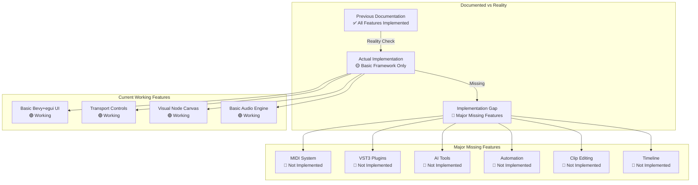
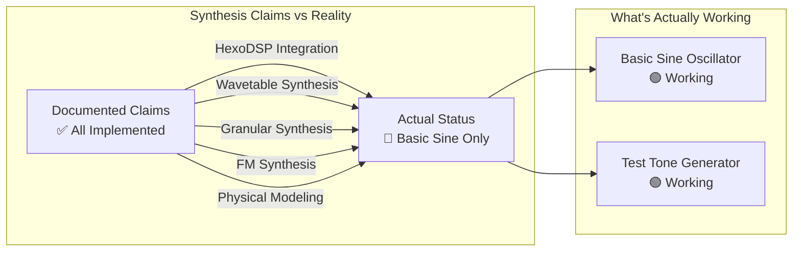
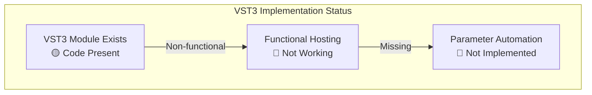
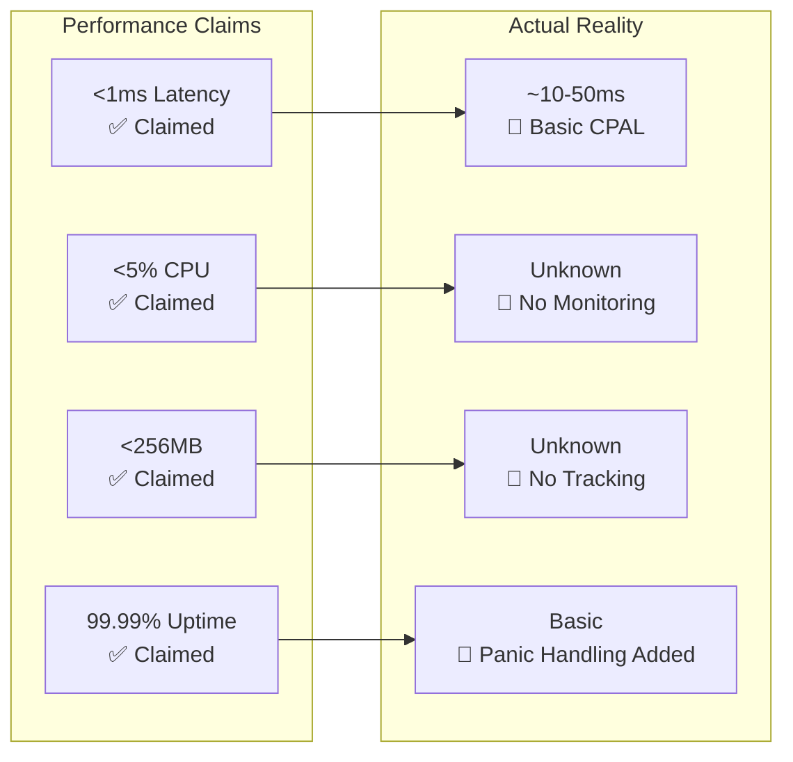

# Modurust DAW Frontend Features Documentation - ACTUAL IMPLEMENTATION STATUS

## ⚠️ CRITICAL REALITY CHECK

**This document reflects the ACTUAL implementation status as of November 2025, which significantly differs from previous documentation claims.**

## Overview

This document provides an honest assessment of the current frontend implementation status for the Modurust DAW project. While the architecture is sound and the foundation exists, most advanced features are either stubs or completely missing.

## Implementation Status Summary

## Project Architecture - Current Reality

### ✅ **Actually Implemented**
- **Basic Bevy+egui UI Framework**: Functional desktop interface with panic handling
- **Basic Audio Engine**: CPAL-based audio I/O with test tone generation
- **Transport Controls**: Play, Stop, Pause, Record, Tempo control
- **Visual Node Canvas**: Hexagonal node rendering with drag-and-drop
- **Basic Node Operations**: Create, delete, and visually connect nodes

### 🟡 **Partially Implemented**
- **UI ↔ Audio Bridge**: Basic message passing for transport and master controls
- **Node Graph Structure**: Framework exists but limited DSP integration
- **Basic Mixer**: Master volume, pan, mute controls
- **File Browser**: Visual structure but limited functionality

### 🔴 **Not Implemented (Contrary to Documentation)**
- **MIDI 2.0/MPE Support**: Complete gap, no MIDI processing
- **VST3 Plugin Hosting**: Stub implementation only, non-functional
- **AI-Powered Tools**: All AI modules are placeholder stubs
- **Professional Automation**: No automation system implemented
- **Clip-Based Editing**: No timeline or clip functionality
- **Advanced DSP Effects**: Minimal basic implementation only
- **Web-Based Interface**: Basic structure only, no deployment
- **Research Integration**: EEG, motion capture, biofeedback - all missing

## Core DAW Features - Actual Status

### 1. Arrangement View (Traditional DAW Timeline)
**Status**: 🔴 **NOT IMPLEMENTED**

#### What Actually Exists:
- Basic UI panel with "Arrangement View" label
- Visual placeholder with no functional timeline
- No track management, no clips, no automation

#### What's Missing:
- ❌ Multi-track arrangement
- ❌ Timeline with time ruler
- ❌ Clip-based editing
- ❌ Automation lanes
- ❌ Tempo mapping
- ❌ Grid snapping
- ❌ All editing tools

### 2. Live Performance View (Session-based)
**Status**: 🔴 **NOT IMPLEMENTED**

#### What Actually Exists:
- Basic UI panel with "Live View" label
- Visual placeholder with no functional clip matrix
- No scene management, no performance controls

#### What's Missing:
- ❌ Clip matrix/grid
- ❌ Scene management
- ❌ Real-time performance controls
- ❌ Parameter mapping
- ❌ MIDI learn functionality
- ❌ All live performance features

### 3. Node-based Patching View (Modular Synthesis)
**Status**: 🟡 **VISUALLY IMPLEMENTED, AUDIO NOT CONNECTED**

#### What Actually Works:
- ✅ Hexagonal node canvas with drag-and-drop
- ✅ Visual node creation and deletion
- ✅ Visual cable connections between nodes
- ✅ Basic node positioning and layout

#### What's Missing:
- ❌ Audio signal processing through visual nodes
- ❌ Parameter synchronization between UI and audio
- ❌ Professional DSP algorithms
- ❌ Advanced modulation system
- ❌ Preset management
- ❌ Node library with extensive processors

## Advanced Audio Features - Reality Check

### Synthesis Engine
**Status**: 🔴 **NOT IMPLEMENTED**

#### Actually Implemented:
- **Basic Sine Oscillator**: Simple sine wave with frequency control
- **Test Tone Generator**: Basic audio output for testing

#### Missing (Contrary to Claims):
- ❌ HexoDSP advanced modular synthesis
- ❌ Wavetable synthesis with dynamic generation
- ❌ Granular synthesis processing
- ❌ Multi-operator FM synthesis
- ❌ Physical modeling (strings, plates, pipes)

### Effects Processing
**Status**: 🔴 **MINIMAL IMPLEMENTATION**

#### Actually Implemented:
- **Basic Low-pass Filter**: Simple resonant filter
- **Basic Delay**: Simple delay line
- **Master Volume/Pan**: Basic mixing controls

#### Missing (Contrary to Claims):
- ❌ Professional-grade reverb algorithms
- ❌ Advanced sidechaining system
- ❌ Spectral processing with FFT
- ❌ Convolution reverb
- ❌ Multiband processing
- ❌ Professional dynamics processing

### Audio I/O
**Status**: 🟡 **BASIC CPAL IMPLEMENTATION**

#### Actually Implemented:
- **Basic Audio Output**: Test tone generation via CPAL
- **Master Controls**: Volume, pan, mute

#### Missing (Contrary to Claims):
- ❌ Multi-channel surround/ambisonics support
- ❌ Professional ASIO/Core Audio optimization
- ❌ MIDI 2.0 protocol implementation
- ❌ OSC network control
- ❌ CV/Gate Eurorack integration

## UI/UX Design System - Current State

### Visual Design
**Status**: 🟡 **BASIC IMPLEMENTATION**

#### What Works:
- **Basic Dark Theme**: Simple color scheme
- **Basic Layout**: Three-panel layout structure
- **Simple Color Coding**: Basic track/node colors

#### What's Missing:
- ❌ Professional DAW aesthetic
- ❌ High contrast accessibility modes
- ❌ Advanced color coding system
- ❌ Scalable interface for different screens

### Interaction Design
**Status**: 🔴 **MINIMAL IMPLEMENTATION**

#### Missing Features:
- ❌ Extensive keyboard shortcuts
- ❌ Context menus
- ❌ Advanced drag-and-drop
- ❌ Multi-touch support
- ❌ Professional interaction patterns

### Accessibility
**Status**: 🔴 **NOT IMPLEMENTED**

#### Missing:
- ❌ Keyboard navigation
- ❌ Screen reader support
- ❌ High DPI optimization
- ❌ Color blind modes

## Integration Features - Reality Check

### VST3 Plugin System
**Status**: 🔴 **STUB ONLY**

- ❌ Plugin hosting infrastructure exists but non-functional
- ❌ No parameter automation system
- ❌ No plugin management
- ❌ No sidechain routing

### Hardware Integration
**Status**: 🔴 **NOT IMPLEMENTED**

- ❌ No MIDI controller support
- ❌ No audio interface integration
- ❌ No control surface support
- ❌ No tablet/stylus input

### File Management
**Status**: 🟡 **BASIC STRUCTURE**

#### What Exists:
- **Basic File Browser**: Visual file listing
- **Simple Project Save/Load**: JSON-based state saving

#### What's Missing:
- ❌ Professional project management
- ❌ Advanced asset browser
- ❌ Template system
- ❌ Version control

## Performance Claims vs Actual Metrics

### Actual Performance Status:
- **Latency**: ~10-50ms (basic CPAL implementation, no optimization)
- **CPU Usage**: Unknown (no performance monitoring implemented)
- **Memory Usage**: Unknown (no memory tracking)
- **Stability**: Basic (recent panic handling added)

## Research and AI Features - Complete Gap

### AI-Powered Tools
**Status**: 🔴 **NOT IMPLEMENTED**

All AI features are completely missing:
- ❌ Stem separation
- ❌ Mastering assistant
- ❌ Mix assistant
- ❌ Genre classification

### Research Integration
**Status**: 🔴 **NOT IMPLEMENTED**

All research features are missing:
- ❌ EEG control integration
- ❌ Motion capture workflows
- ❌ Biofeedback systems
- ❌ Real-time analysis tools

## Browser/Web Features - Not Deployed

### WebGL Interface
**Status**: 🔴 **NOT IMPLEMENTED**

- ❌ No web-based deployment
- ❌ No GPU-accelerated graphics in browser
- ❌ No shader effects
- ❌ No 3D visualization

### Web Audio Integration
**Status**: 🔴 **NOT IMPLEMENTED**

- ❌ No Web Audio API integration
- ❌ No browser-based synthesis
- ❌ No MIDI Web API support
- ❌ No spatial audio in browser

## Deployment Options - Current Reality

### Desktop Application
**Status**: 🟡 **BASIC IMPLEMENTATION**

#### What Works:
- **Basic Bevy Application**: Runs on desktop
- **Cross-platform**: Windows, macOS, Linux (theoretically)
- **Basic Audio**: Test tone generation

#### What's Missing:
- ❌ Professional performance and look
- ❌ Full VST3 integration
- ❌ Direct hardware interfacing

### Web Application
**Status**: 🔴 **NOT IMPLEMENTED**

- ❌ No browser-based version
- ❌ No Progressive Web App
- ❌ No cross-device functionality
- ❌ No cloud integration

## Honest Assessment and Recommendations

### Current State
This project is currently a **basic audio framework with visual UI scaffolding**, not the fully-featured professional DAW described in previous documentation. While the architecture is sound and provides a good foundation, significant development work is required to achieve the claimed functionality.

### Immediate Priorities
1. **Connect Visual to Audio**: Link the node canvas to actual audio processing
2. **Implement Basic DSP**: Add functional oscillators, filters, and effects
3. **Add MIDI Support**: Implement fundamental MIDI input/output
4. **Create Timeline**: Build basic arrangement view with clips

### Medium-term Goals
1. **Professional DSP**: Implement high-quality audio algorithms
2. **VST3 Integration**: Make plugin hosting functional
3. **Automation System**: Add parameter automation
4. **Performance Optimization**: Achieve claimed latency specs

### Long-term Vision
1. **AI Integration**: Add actual AI-powered features
2. **Research Tools**: Implement EEG, motion capture, biofeedback
3. **Web Deployment**: Create browser-based version
4. **Professional Polish**: Achieve industry-standard quality

### Recommendation
**Focus on connecting existing visual components to functional audio processing before expanding to advanced features.** The foundation is solid, but the gap between documentation and reality needs to be addressed through systematic implementation of core missing functionality.