# HexoDSP Node-Based System Features Documentation

## Overview

This document provides a comprehensive overview of the node-based audio processing system in HexoDSP DAW, including current implementation status, planned features, and architectural design. The node system is designed as a modular, visual programming environment for audio signal processing and synthesis.

## System Architecture

```mermaid
graph TB
    subgraph "Node System Architecture"
        UI["UI Layer<br/>Hexagonal Node View"]
        NM["Node Manager<br/>NodeInstanceManager"]
        NG["Node Graph<br/>Audio Processing Graph"]
        DSP["DSP Core<br/>Audio Processing"]
        BRIDGE["Audio Bridge<br/>UI ↔ Audio Communication"]
    end
    
    subgraph "Node Categories"
        GEN["Generators<br/>Oscillators, Noise"]
        FX["Effects<br/>Filters, Delays, Reverbs"]
        UTIL["Utilities<br/>Mixers, Meters"]
        IO["I/O<br/>Input/Output Nodes"]
    end
    
    UI --> |"Visual Editing"| NM
    NM --> |"Node Operations"| NG
    NG --> |"Audio Processing"| DSP
    BRIDGE --> |"Parameter Updates"| NM
    
    NG --> GEN
    NG --> FX
    NG --> UTIL
    NG --> IO
```



## Implementation Status Matrix

| Component | Status | Description | Priority |
|-----------|--------|-------------|----------|
| **Visual Node Canvas** | ✅ **Implemented** | Hexagonal node rendering with drag-and-drop | High |
| **Node Creation/Deletion** | ✅ **Implemented** | Add/remove nodes via UI | High |
| **Visual Connections** | ✅ **Implemented** | Draw cables between nodes | High |
| **Audio Graph Processing** | 🟡 **Basic** | Simple oscillator → filter → output | High |
| **Parameter Synchronization** | 🟡 **Partial** | Basic parameter updates | Medium |
| **Advanced DSP Nodes** | 🔴 **Not Implemented** | Professional-grade effects | Medium |
| **Preset System** | 🔴 **Not Implemented** | Save/load node configurations | Low |
| **Modulation System** | 🔴 **Not Implemented** | LFOs, envelopes, CV | Medium |

## Node Categories and Types

### 1. Generator Nodes

```mermaid
graph LR
    subgraph "Generator Nodes - Implementation Status"
        OSC["Oscillator<br/>🟡 Basic Sine"]
        NOISE["Noise Generator<br/>🔴 Not Implemented"]
        WT["Wavetable<br/>🔴 Not Implemented"]
        GRAIN["Granular<br/>🔴 Not Implemented"]
        FM["FM Operator<br/>🔴 Not Implemented"]
        PHYS["Physical Model<br/>🔴 Not Implemented"]
    end
    
    subgraph "Oscillator Types"
        SINE["Sine Wave<br/>🟢 Implemented"]
        SAW["Sawtooth<br/>🔴 Not Implemented"]
        SQUARE["Square<br/>🔴 Not Implemented"]
        TRI["Triangle<br/>🔴 Not Implemented"]
    end
    
    OSC --> SINE
    OSC -.-> SAW
    OSC -.-> SQUARE
    OSC -.-> TRI
```



#### Currently Implemented:
- **Basic Sine Oscillator**: Simple sine wave generation with frequency and amplitude controls

#### Planned but Not Implemented:
- **Multi-wave Oscillator**: Sine, sawtooth, square, triangle waves with morphing
- **Wavetable Oscillator**: Dynamic wavetable synthesis with scanning
- **Granular Oscillator**: Real-time granular synthesis with grain controls
- **FM Operator**: Frequency modulation synthesis with multiple operators
- **Physical Modeling**: String, plate, and pipe physical models
- **Noise Generator**: White, pink, brown noise with filtering

### 2. Filter Nodes

```mermaid
graph TD
    subgraph "Filter Nodes - Status"
        LPF["Low Pass Filter<br/>🟡 Basic"]
        HPF["High Pass Filter<br/>🔴 Not Implemented"]
        BPF["Band Pass Filter<br/>🔴 Not Implemented"]
        BRF["Band Reject Filter<br/>🔴 Not Implemented"]
        PEQ["Parametric EQ<br/>🔴 Not Implemented"]
        GRAPHIC["Graphic EQ<br/>🔴 Not Implemented"]
        COMB["Comb Filter<br/>🔴 Not Implemented"]
        FORMANT["Formant Filter<br/>🔴 Not Implemented"]
    end
    
    subgraph "Filter Characteristics"
        FREQ["Frequency Control<br/>🟢 Implemented"]
        RES["Resonance<br/>🟡 Basic"]
        DRIVE["Drive/Saturation<br/>🔴 Not Implemented"]
        MODE["Filter Mode<br/>🔴 Not Implemented"]
    end
    
    LPF --> FREQ
    LPF --> RES
    LPF -.-> DRIVE
    LPF -.-> MODE
```



#### Currently Implemented:
- **Basic Low Pass Filter**: Simple resonant low-pass filter with frequency control

#### Planned but Not Implemented:
- **Multi-mode Filter**: Switchable between LP, HP, BP, BR modes
- **Parametric EQ**: Professional-grade equalizer with multiple bands
- **Graphic EQ**: Fixed-band equalizer with visual frequency response
- **Comb Filter**: Delay-based comb filtering for special effects
- **Formant Filter**: Vocal formant filtering for speech synthesis
- **Filter Drive**: Analog-style saturation and drive circuits

### 3. Effects Nodes

```mermaid
graph LR
    subgraph "Effects Nodes - Status"
        DELAY["Delay<br/>🟡 Basic"]
        REVERB["Reverb<br/>🔴 Not Implemented"]
        CHORUS["Chorus<br/>🔴 Not Implemented"]
        PHASER["Phaser<br/>🔴 Not Implemented"]
        FLANGER["Flanger<br/>🔴 Not Implemented"]
        DISTORTION["Distortion<br/>🔴 Not Implemented"]
        COMPRESSOR["Compressor<br/>🔴 Not Implemented"]
        LIMITER["Limiter<br/>🔴 Not Implemented"]
        GATE["Gate<br/>🔴 Not Implemented"]
    end
    
    subgraph "Delay Types"
        SIMPLE["Simple Delay<br/>🟢 Implemented"]
        STEREO["Stereo Delay<br/>🔴 Not Implemented"]
        PINGPONG["Ping Pong<br/>🔴 Not Implemented"]
        MULTITAP["Multi-tap<br/>🔴 Not Implemented"]
        TAPE["Tape Delay<br/>🔴 Not Implemented"]
    end
    
    DELAY --> SIMPLE
    DELAY -.-> STEREO
    DELAY -.-> PINGPONG
    DELAY -.-> MULTITAP
    DELAY -.-> TAPE
```



#### Currently Implemented:
- **Basic Delay**: Simple delay line with time and feedback controls

#### Planned but Not Implemented:
- **Stereo Delay**: Independent delay times for left/right channels
- **Ping Pong Delay**: Alternating delay panning for spatial effects
- **Multi-tap Delay**: Multiple delay taps with independent controls
- **Tape Delay**: Analog-style tape delay with saturation
- **Reverb**: Algorithmic and convolution reverbs
- **Chorus/Phaser/Flanger**: Modulation-based effects
- **Dynamics**: Compressor, limiter, gate, expander
- **Distortion**: Various distortion algorithms from subtle to extreme

### 4. Utility Nodes

```mermaid
graph TD
    subgraph "Utility Nodes - Status"
        MIXER["Mixer<br/>🟡 Basic"]
        GAIN["Gain<br/>🟢 Implemented"]
        PAN["Pan<br/>🟡 Basic"]
        METER["Meter<br/>🟡 Basic"]
        SCOPE["Oscilloscope<br/>🔴 Not Implemented"]
        SPECTRUM["Spectrum<br/>🔴 Not Implemented"]
        STEREO["Stereo Tools<br/>🔴 Not Implemented"]
        MATH["Math<br/>🔴 Not Implemented"]
        LOGIC["Logic<br/>🔴 Not Implemented"]
    end
    
    subgraph "Mixer Types"
        STEREO_MIX["Stereo Mixer<br/>🟡 Basic"]
        MULTI["Multi-channel<br/>🔴 Not Implemented"]
        BUS["Bus Mixer<br/>🔴 Not Implemented"]
        MATRIX["Matrix Mixer<br/>🔴 Not Implemented"]
    end
    
    MIXER --> STEREO_MIX
    MIXER -.-> MULTI
    MIXER -.-> BUS
    MIXER -.-> MATRIX
```



#### Currently Implemented:
- **Gain**: Simple gain/attenuation control
- **Basic Mixer**: Simple stereo mixing with level controls
- **Basic Pan**: Simple stereo panning
- **Basic Meter**: Peak level metering

#### Planned but Not Implemented:
- **Multi-channel Mixer**: Flexible mixing with multiple inputs/outputs
- **Matrix Mixer**: Complex routing matrix for advanced signal flow
- **Oscilloscope**: Real-time waveform visualization
- **Spectrum Analyzer**: Real-time frequency analysis
- **Stereo Tools**: Mid/side processing, stereo width, correlation
- **Math Nodes**: Arithmetic operations for control voltages
- **Logic Nodes**: Boolean operations for event processing

## Node Connection System


### Connection Features Status

#### ✅ **Implemented:**
- **Visual Cable Rendering**: Bezier curves with color coding
- **Basic Audio Routing**: Connect output to input ports
- **Port Highlighting**: Visual feedback on hover/connection
- **Connection Management**: Add/remove connections via UI

#### 🟡 **Partially Implemented:**
- **Signal Flow**: Basic audio signal routing works for simple chains
- **Connection Validation**: Basic port compatibility checking

#### 🔴 **Not Implemented:**
- **Control Voltage System**: CV signals for modulation
- **MIDI Routing**: MIDI signal connections between nodes
- **Sync/Clock Distribution**: Timing signals for synchronization
- **Bus System**: Named busses for complex routing
- **Feedback Detection**: Automatic prevention of feedback loops
- **Multi-channel Audio**: Surround and multi-channel routing

## Parameter System

```mermaid
graph LR
    subgraph "Parameter Types"
        CONTINUOUS["Continuous<br/>🟡 Basic"]
        DISCRETE["Discrete<br/>🔴 Not Implemented"]
        BOOLEAN["Boolean<br/>🔴 Not Implemented"]
        STRING["String<br/>🔴 Not Implemented"]
        ARRAY["Array<br/>🔴 Not Implemented"]
    end
    
    subgraph "Parameter Features"
        SYNC["UI ↔ Audio Sync<br/>🟡 Basic"]
        AUTOMATION["Automation<br/>🔴 Not Implemented"]
        MODULATION["Modulation<br/>🔴 Not Implemented"]
        PRESETS["Presets<br/>🔴 Not Implemented"]
        RANDOMIZE["Randomize<br/>🔴 Not Implemented"]
    end
    
    CONTINUOUS --> SYNC
    SYNC -.-> AUTOMATION
    AUTOMATION -.-> MODULATION
```



### Parameter Implementation Status

#### ✅ **Basic Implementation:**
- **Continuous Parameters**: Float values with min/max ranges
- **UI Controls**: Sliders, knobs, numeric entry
- **Basic Synchronization**: Parameter changes sent to audio engine

#### 🔴 **Missing Features:**
- **Discrete Parameters**: Integer values with step sizes
- **Boolean Parameters**: On/off switches and buttons
- **String Parameters**: Text-based parameter values
- **Array Parameters**: Multi-value parameter arrays
- **Parameter Automation**: Timeline-based parameter changes
- **Modulation System**: LFOs, envelopes, and control voltage
- **Parameter Presets**: Save/restore parameter sets
- **Parameter Randomization**: Random parameter value generation
- **MIDI Learn**: Assign MIDI controllers to parameters
- **Parameter Grouping**: Organize related parameters

## Visual Programming Features


### Visual Programming Implementation

#### ✅ **Implemented:**
- **Drag & Drop**: Create and move nodes on canvas
- **Basic Zoom/Pan**: Navigate the node canvas
- **Connection Drawing**: Visual cables between nodes
- **Node Selection**: Select and highlight nodes

#### 🔴 **Not Implemented:**
- **Node Grouping**: Group related nodes together
- **Comments/Annotations**: Add text notes to patches
- **Bookmarks**: Save and recall canvas positions
- **Node Search**: Search for nodes by name or type
- **Patch Snapshots**: Save/restore patch states
- **Node Macros**: Create reusable node combinations
- **Sub-graphs**: Nested graph structures
- **Patch Templates**: Pre-configured node setups
- **Version Control**: Track changes to patches
- **Real-time Collaboration**: Multiple users editing simultaneously

## Performance and Optimization

```mermaid
graph LR
    subgraph "Performance Features"
        REALTIME["Real-time Processing<br/>🟡 Basic"]
        MULTI["Multi-threading<br/>🔴 Not Implemented"]
        SIMD["SIMD Optimization<br/>🔴 Not Implemented"]
        CACHE["Node Caching<br/>🔴 Not Implemented"]
        LAZY["Lazy Evaluation<br/>🔴 Not Implemented"]
    end
    
    subgraph "Monitoring"
        CPU["CPU Usage<br/>🔴 Not Implemented"]
        LATENCY["Latency Monitoring<br/>🔴 Not Implemented"]
        MEMORY["Memory Usage<br/>🔴 Not Implemented"]
        PROFILING["Profiling<br/>🔴 Not Implemented"]
    end
    
    REALTIME --> CPU
    MULTI -.-> LATENCY
    SIMD -.-> MEMORY
```



### Performance Status

#### 🟡 **Basic Performance:**
- **Real-time Processing**: Basic audio callback processing
- **Simple Node Chains**: Low-latency processing for basic setups

#### 🔴 **Missing Optimizations:**
- **Multi-threading**: Parallel processing across CPU cores
- **SIMD Optimization**: Vectorized DSP operations
- **Node Caching**: Intelligent caching of node outputs
- **Lazy Evaluation**: Process only active signal paths
- **Performance Monitoring**: CPU, memory, and latency metrics
- **Automatic Optimization**: Intelligent node reordering
- **GPU Acceleration**: CUDA/OpenCL processing support

## Integration with Other Systems


### Integration Status

#### 🔴 **Not Implemented:**
- **DAW Timeline Integration**: Use node graphs in timeline/arrangement
- **MIDI System**: MIDI control of node parameters
- **VST3 Plugin Integration**: Use VST3 plugins as nodes
- **Hardware Integration**: Audio interface integration
- **Web Interface**: Browser-based node editing
- **Preset Sharing**: Share node configurations
- **Export/Import**: Save/load node graphs as files
- **Cloud Synchronization**: Sync patches across devices
- **External API**: Control nodes via external software

## Development Roadmap

### Phase 1: Core Foundation (Current Status)
- ✅ Basic node visual canvas
- ✅ Simple node creation/deletion
- ✅ Visual connections
- ✅ Basic audio processing chain
- 🟡 Parameter synchronization

### Phase 2: Essential Features (Next Priority)
- 🔴 Connect visual nodes to audio engine
- 🔴 Implement basic DSP nodes (filters, effects)
- 🔴 Add parameter automation
- 🔴 Implement MIDI control
- 🔴 Add preset system

### Phase 3: Professional Features (Medium-term)
- 🔴 Advanced DSP algorithms
- 🔴 Multi-threading optimization
- 🔴 VST3 plugin integration
- 🔴 Professional metering
- 🔴 Advanced modulation system

### Phase 4: Advanced Integration (Long-term)
- 🔴 DAW timeline integration
- 🔴 Real-time collaboration
- 🔴 AI-powered node suggestions
- 🔴 Cloud-based processing
- 🔴 Hardware acceleration

## Technical Implementation Details

### Node Structure

```rust
pub struct Node {
    pub id: NodeId,
    pub node_type: NodeType,
    pub position: Position,
    pub parameters: HashMap<String, Parameter>,
    pub inputs: Vec<Port>,
    pub outputs: Vec<Port>,
    pub processing_fn: Box<dyn Fn(&[f32], &mut [f32]) + Send + Sync>,
}
```

### Connection Management

```rust
pub struct Connection {
    pub id: ConnectionId,
    pub from_node: NodeId,
    pub from_port: PortId,
    pub to_node: NodeId,
    pub to_port: PortId,
    pub connection_type: ConnectionType,
}
```

### Audio Processing Chain

```rust
impl NodeGraph {
    pub fn process(&mut self, input: &[f32], output: &mut [f32]) {
        // Topological sort for correct processing order
        let processing_order = self.topological_sort();
        
        // Process each node in order
        for node_id in processing_order {
            let node = &mut self.nodes[node_id];
            node.process(input, output);
        }
    }
}
```

## Conclusion

The HexoDSP node-based system currently provides a solid visual foundation with basic audio processing capabilities. While the visual programming interface is functional and demonstrates the intended user experience, the majority of advanced DSP features, professional audio processing, and system integrations remain to be implemented.

The architecture is well-designed and extensible, providing a strong foundation for developing a comprehensive modular audio processing environment. Priority should be given to connecting the existing visual components to functional audio processing and implementing core DSP algorithms before expanding to advanced features.